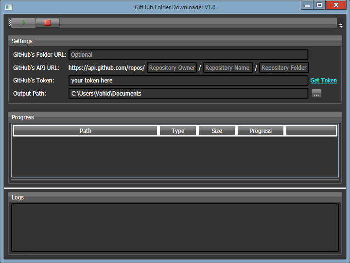

GitHub Folder Downloader
=======
GitHub Folder Downloader lets you to download a single folder of a repository without cloning or downloading the whole repository.

Usage:
=======
* Download the latest version of the application from the [releases section](https://github.com/VahidN/GitHubFolderDownloader/releases). It needs .NET 4.0.
* Also you need to get your GitHub API's token form [here](https://github.com/settings/tokens) to complete the `GitHub's Token` field.
* Then fill the `GitHub's Folder URL` field.
* Click at the green button to start.